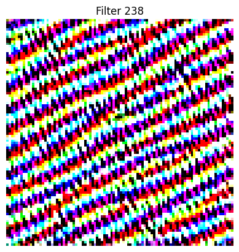
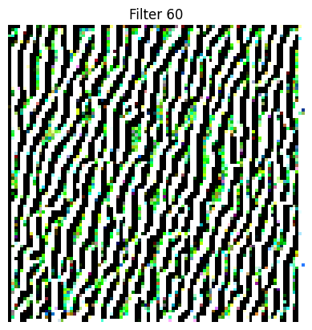
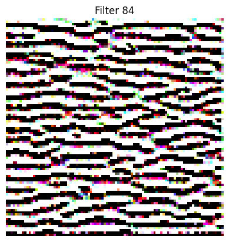

# **Visualizing Filters of a CNN using TensorFlow**

## **Overview**
This project demonstrates the visualization of filters from various layers of a Convolutional Neural Network (CNN) using the popular VGG16 model. By applying gradient ascent techniques, we generate images that maximally activate specific filters, helping us understand the patterns learned by different layers of the CNN.

The goal is to make the "black box" nature of CNNs more interpretable by visualizing their inner workings.

---

## **Key Features**
- Uses the pre-trained VGG16 model for image classification tasks.
- Visualizes activation patterns for filters from convolutional layers.
- Implements **gradient ascent** to maximize activations for specific filters.
- Provides insights into hierarchical feature extraction by the CNN.

---

## **Demo**
Here are examples of filters visualized from different layers of the VGG16 model:

### **Layer: Block1_Conv1**

### **Layer: Block2_Conv1**

---

### **Results :**

Early layers (e.g., Block1_Conv1) visualize simple patterns like edges and colors.
Mid-level layers (e.g., Block3_Conv1) capture textures and repeating patterns.
Deeper layers (e.g., Block5_Conv3) highlight complex structures like shapes and object parts.
